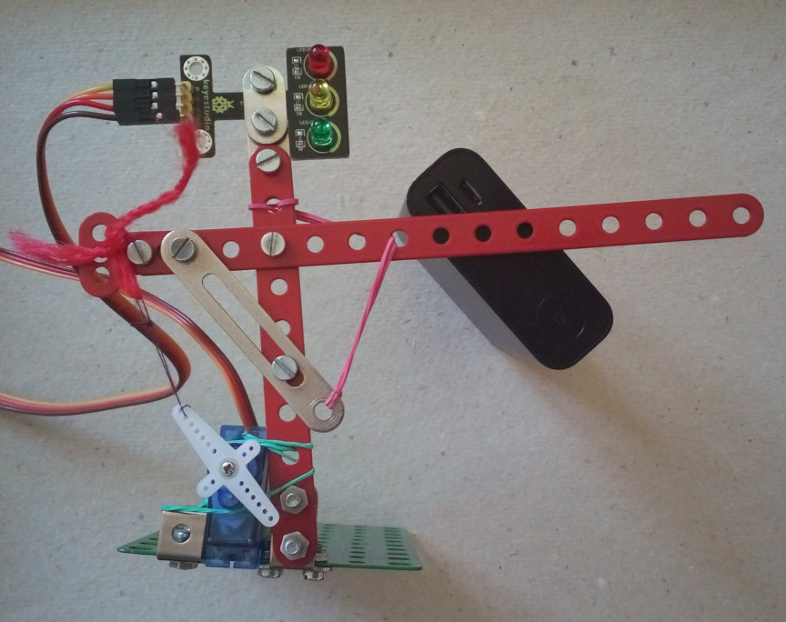
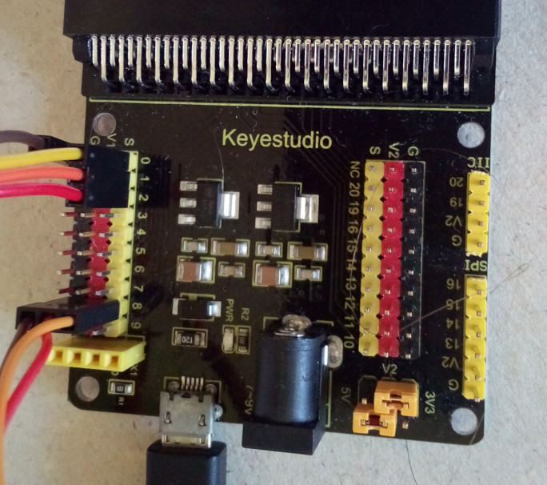

> Az oldal megnyitása itt: [https://nevergone.github.io/keyestudio-jelzolampa/](https://nevergone.github.io/keyestudio-jelzolampa/)

A jelzőlámpa a 0-2 pinre, a sensor motor a 8. pinre van kötve.

### Használt eszközök

* Merkur 330
* [Ks0360 Keyestudio Sensor Shield V2 for BBC micro:bit](https://www.keyestudio.com/keyestudio-sensor-shield-module-v2-for-bbc-microbit-p0115-p0115.html)
* [Ks0209 keyestudio 9G Servo Motor Blue 90°](https://www.keyestudio.com/1pcs-keyestudio-9g-mini-sg90-90-degrees-servo-motor-blue-with-ph254-connector-for-arduino-robot-car-p0454-p0454.html)
* [Keyestudio Traffic Light Module (Black and Eco-friendly) For arduino](https://www.keyestudio.com/products/keyestudio-traffic-light-module-black-and-eco-friendly-for-arduino)

## Képek

## Használj egy bővítményt

Ez a repó **bővítményként** használható a MakeCode-ban.

* [https://makecode.microbit.org/](https://makecode.microbit.org/) megnyitása
* kattints au **Új projekt**-re
* kattints a **Bővítmények** gombra a fogaskerék menüben
* **https://github.com/nevergone/keyestudio-jelzolampa** keresése, majd importálás

## A projekt szerkesztése 

A repó szerkesztése a MakeCode-ban.

* [https://makecode.microbit.org/](https://makecode.microbit.org/) megnyitása
* kattints az **Import**-ra, utána az **Import URL**-re
* illeszd be a **https://github.com/nevergone/keyestudio-jelzolampa** címet és kattints az importra

## Blokkok előnézete

Ezen a képen az utolsó, fő ághoz tartozó verzió blokk kódja látható.
A kép frissítése eltarthat néhány percig.

#### Metaadatok (kereséshez, rendereléshez)

* for PXT/microbit

